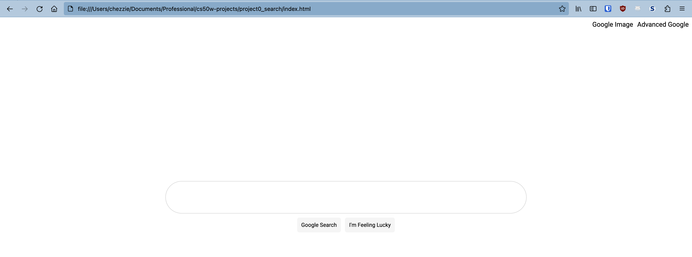
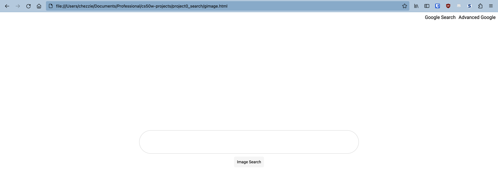
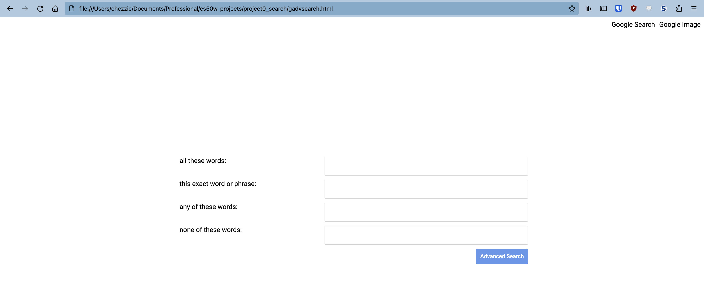

# Google Mimic

This project will be all about understanding HTML forms, as well as brushing up on my CSS

## Functionalities:

### Regular Google Search:

### Image Search:

### Advanced Search:

## Learning Outcomes:

☑ Learn more about using HTML forms and GET requests

- Each page redirects to its respective Google page

☑ Brush up on CSS

- Used Flexbox to style most containers
