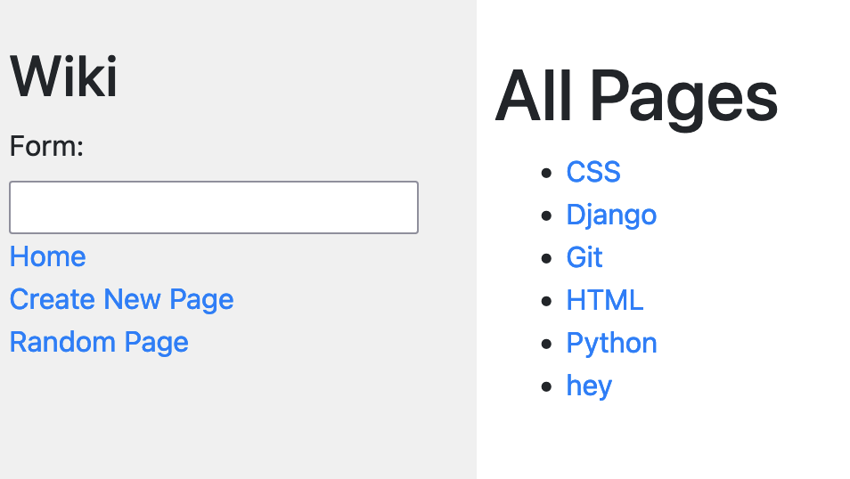
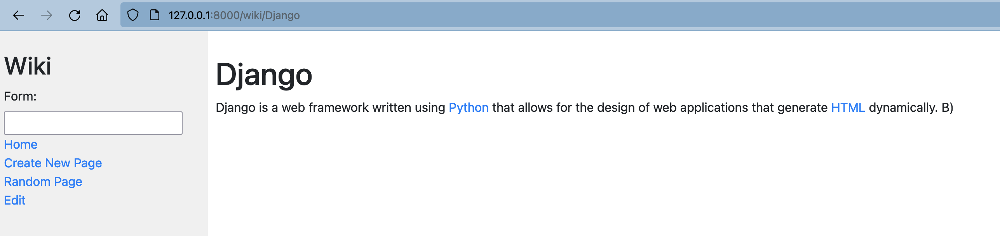
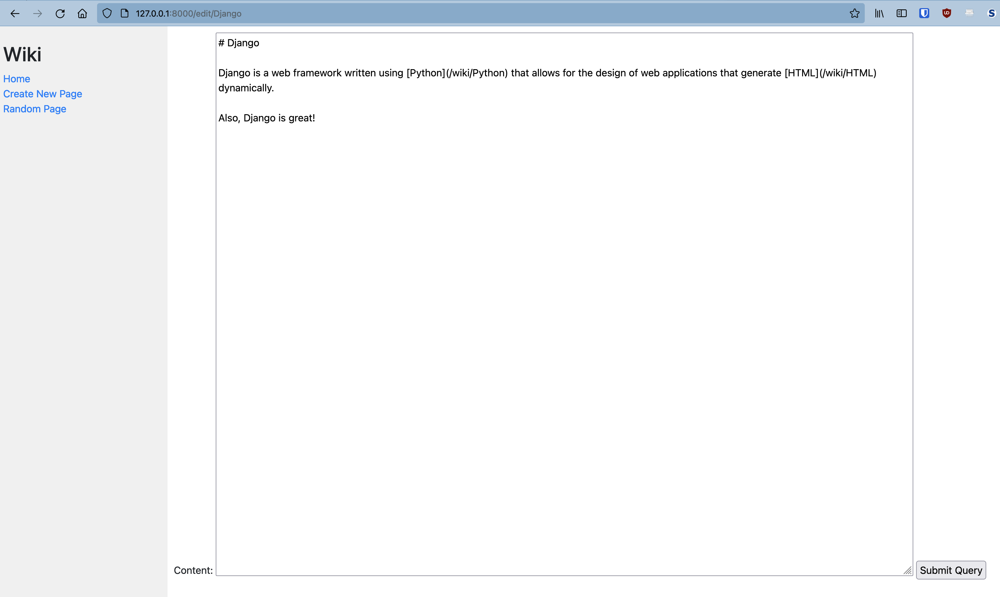
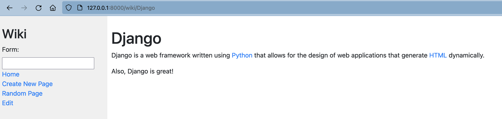
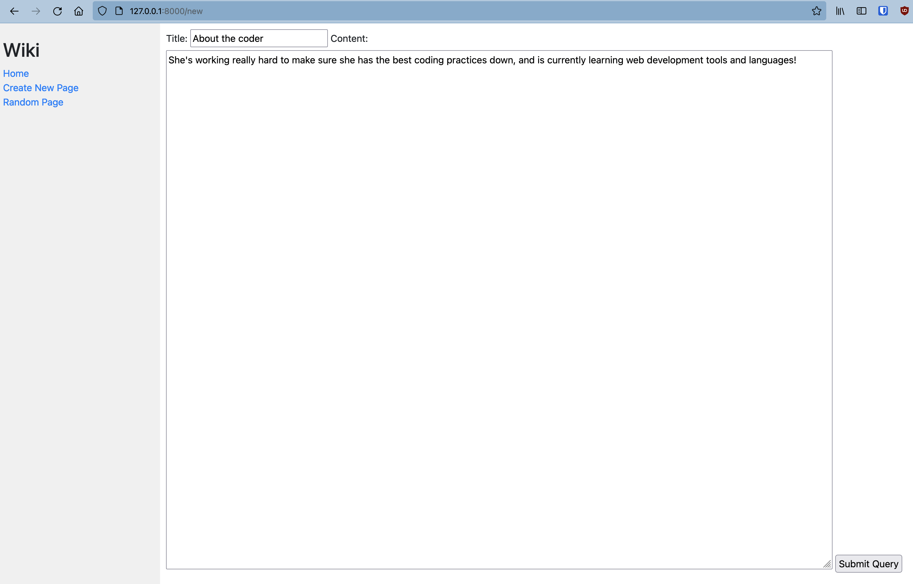
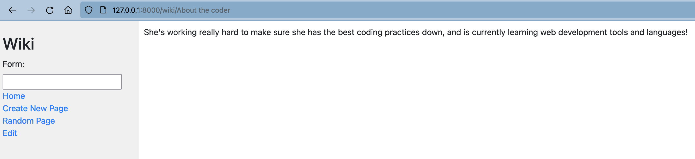

# A Wikipedia Clone

This is the "first" project of CS50w, where I learn how to navigate through Django.

## Functionalities:

### View all wiki entries:

### View an individual entry:

### Edit an individual entry:

### Create a new entry:

### Go to a random page (clicking on the random link)

## Learning Outcomes:

☑ Use Django forms

- Utilized Django forms for editing and creating new entries

☑ Learn how to use Django for a multi-page website
