## A Commerce Website

Welcome to the second project of CS50w! Here, we start to edge towards a fully functional website, complete with user login and databases.

## Theme: An auction page!

This website allows users to create listings, add them to their wishlists, bid on them, and leave comments.

## Functionalities

### Create a new listing:

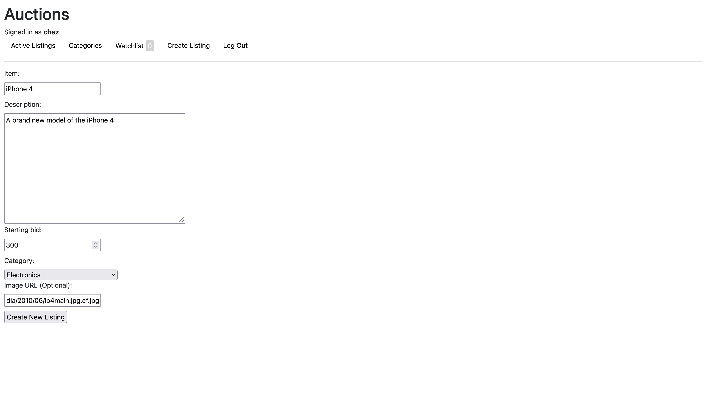

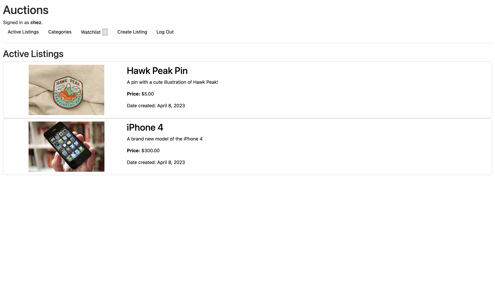
_After the listing is created, the website redirects you back to the active listings page_

Some extra functionalities: If an image is not provided, an "image not found" image will be provided instead.

### Bid on the item:

Bidders can bid as much as the starting price, and more than the price of other bids. Here, we're signed in as a different user to showcase bidding.

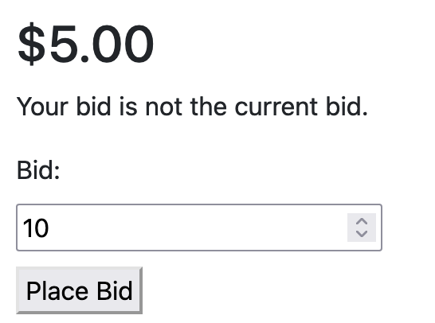

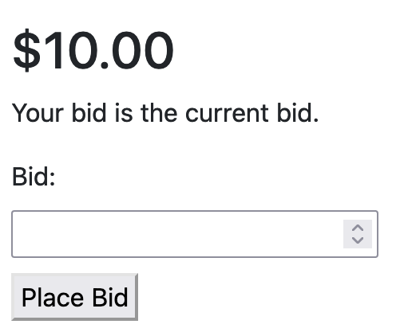

If somebody tries to bid below the displayed amount, they're shown with this page:

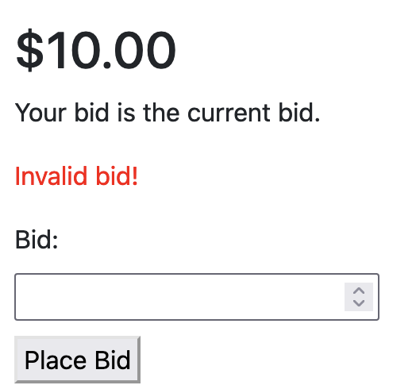

### Add to watchlist:

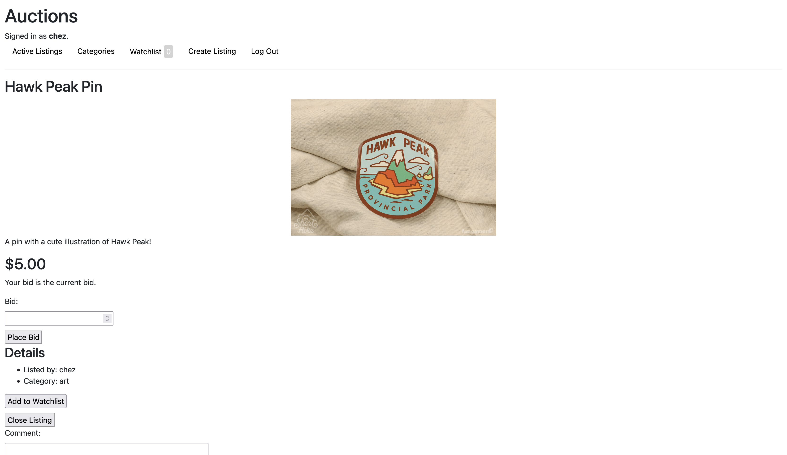
_Before watchlisting_

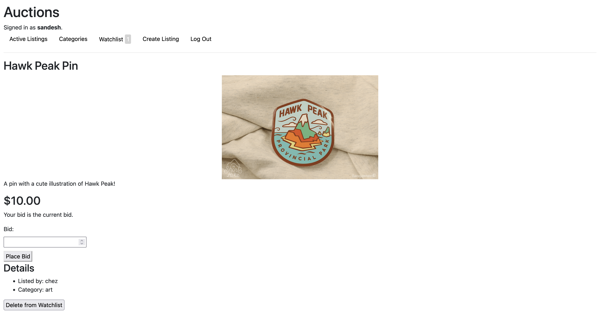
_After watchlisting; notice how the counter increments!_

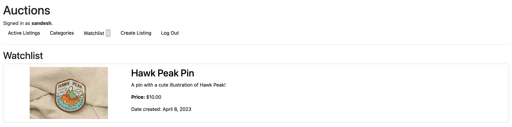
_Watchlist page_

### Comments:

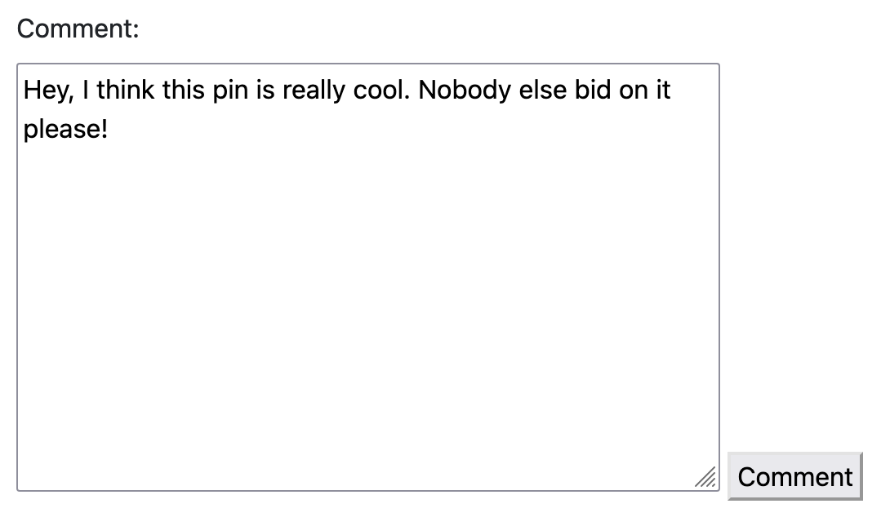

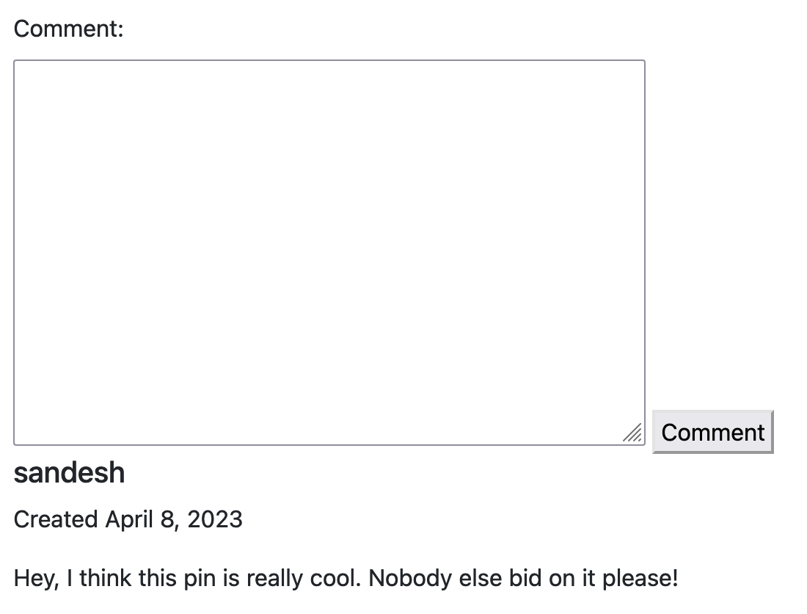

### Closing a listing:

I've signed in as the original seller of this item in order to show this functionality:

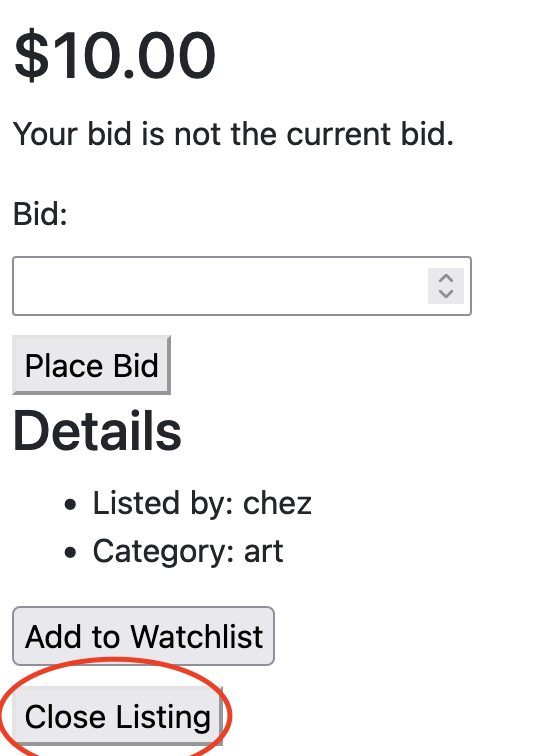

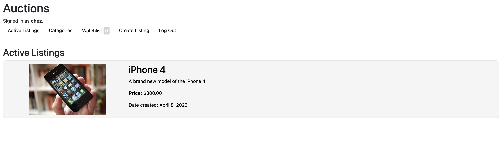
_Listing is removed from active listings_

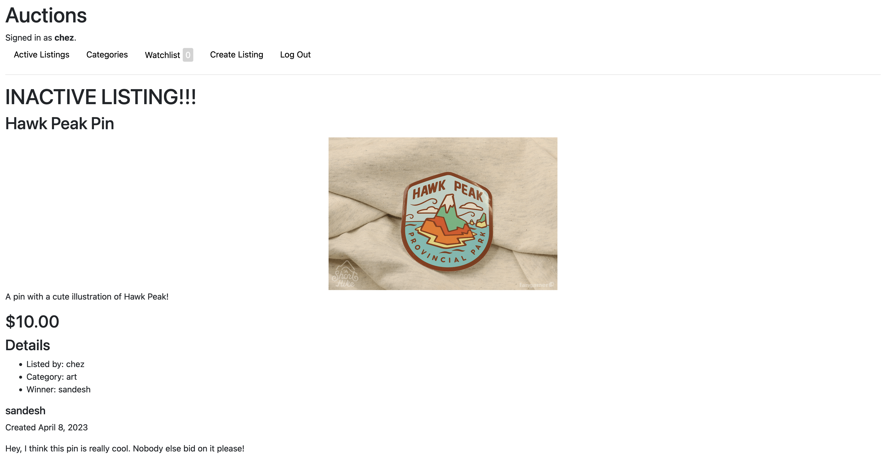
_The winner of the listing is listed; watchlisting, bidding, and commenting functions are also disabled_

### Viewing listings by category:

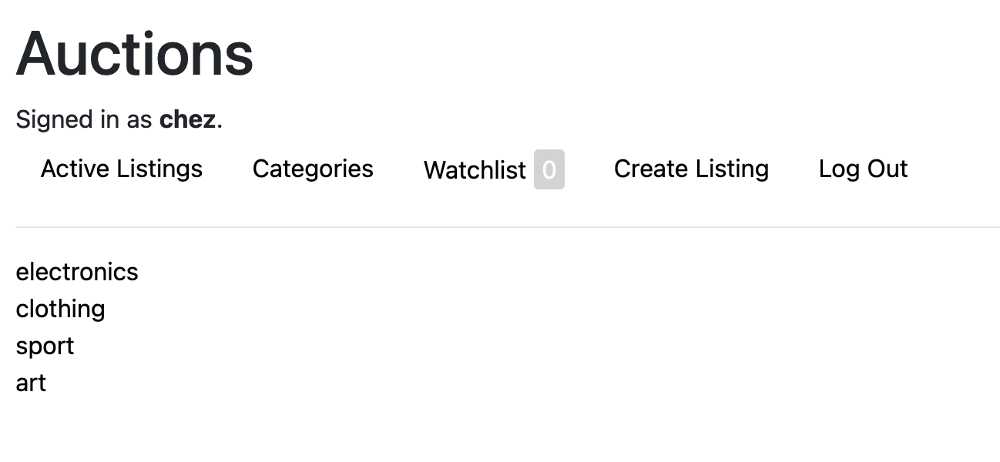

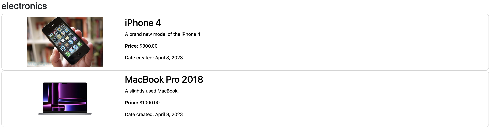
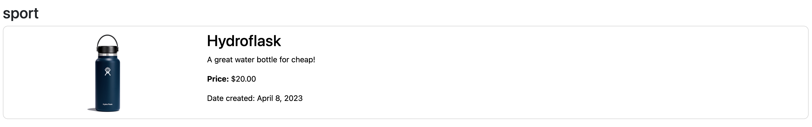

## Learning Outcomes:

☑ Use databases with Django

- Learned about one to many and many to many relationships between databases using `models.ForeignKey` and `models.ManyToManyField`
- Created new entries by first establishing the models in `models.py` and then using Python in `views.py` to create and save entries based on interactions
- Used for the 'Create Listing', 'Bid', and 'Comment' functionalities
- Separated listings by category attributes in models

☑ Use a CSS framework

- Used Bootstrap to style most of the website, but still used some custom CSS to make it look decent

☑ Create a user system with login and registration

- Built the whole website to be user-specific, including watchlisting, bidding, creating listings, etc.
- Used user authentication with Python
